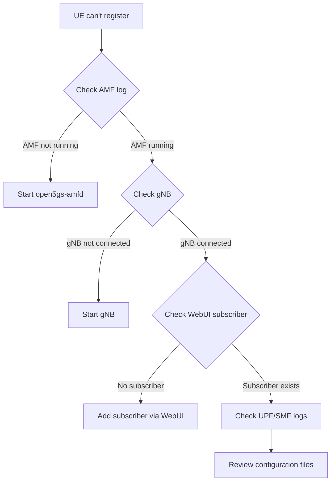

# Runbook — CloudlyRAN (Open5GS + srsRAN)

## 0. Vagrant Setup — VM Provisioning

### Prerequisites (Host Machine)

| Requirement          | Notes                                            |
|----------------------|--------------------------------------------------|
| VMware Workstation   | Required for AVX passthrough (MongoDB 8.0 needs it) |
| Vagrant              | Install from [vagrantup.com](https://vagrantup.com) |
| Vagrant VMware Utility | [Download here](https://developer.hashicorp.com/vagrant/install/vmware) |

### Install the VMware Provider Plugin

Once Vagrant and the VMware Utility are installed, install the plugin:

```bash
vagrant plugin install vagrant-vmware-desktop
```

Verify it's installed:

```bash
vagrant plugin list
# → Should show: vagrant-vmware-desktop (x.y.z)
```

### Start the VM

Clone the repository, navigate to the project root, and bring up the VM. This will automatically build Open5GS, srsRAN, all dependencies, and start the 5G core network.

```bash
# On host machine — clone the repo
git clone https://github.com/ShaonAnNafi/ShaonAnNafi_CloudlyRAN.git
cd ShaonAnNafi_CloudlyRAN

# Start & provision (builds Open5GS + srsRAN + all dependencies)
vagrant up
```

> **Note:** `vagrant up` runs the provisioning scripts automatically:
> 1. `scripts/setup_dependencies.sh` — installs MongoDB 8.0, Node.js, build tools, TUN/NAT
> 2. `scripts/build_open5gs.sh` — builds Open5GS and starts the WebUI
> 3. `scripts/build_srsran.sh` — builds srsRAN with ZMQ support
> 4. `configs/open5gs/configure_open5gs.sh` — configures all Open5GS components
> 5. `configs/srsran/configure_srsRAN.sh` — configures the gNB

Once provisioning completes, SSH into the VM:

```bash
vagrant ssh
```

Then proceed to **Section 1** to verify all services are running.


### Useful Vagrant Commands

| Command                      | Description                              |
|------------------------------|------------------------------------------|
| `vagrant up`                 | Create and provision the VM              |
| `vagrant ssh`                | SSH into the running VM                  |
| `vagrant halt`               | Gracefully shut down the VM              |
| `vagrant destroy`            | Destroy the VM (frees up disk)           |
| `vagrant provision`          | Re-run provisioning scripts              |
| `vagrant reload`             | Restart VM (applies Vagrantfile changes) |
| `vagrant status`             | Check if VM is running                   |
| `vagrant plugin list`        | List installed Vagrant plugins           |

### Port Forwarding

The `Vagrantfile` forwards port **9999** on the VM to **8080** on your host (localhost). Once the WebUI is running inside the VM, open:

```
http://localhost:8080
```

in your browser on the **host machine**.

---

## 1. Checking All Open5GS Services

Verify all core network processes are running:

```bash
sudo ss -lnput | grep open5gs
```

**Example output** (your actual ports and IPs will be shown):

```
udp   UNCONN 0      0                127.0.0.3:8805       0.0.0.0:*    users:(("open5gs-sgwcd",pid=34973,fd=7))
udp   UNCONN 0      0                127.0.0.4:8805       0.0.0.0:*    users:(("open5gs-smfd",pid=34871,fd=15))
udp   UNCONN 0      0                10.11.0.2:8805       0.0.0.0:*    users:(("open5gs-upfd",pid=34874,fd=7))
udp   UNCONN 0      0                127.0.0.3:2123       0.0.0.0:*    users:(("open5gs-sgwcd",pid=34973,fd=6))
udp   UNCONN 0      0                127.0.0.2:2123       0.0.0.0:*    users:(("open5gs-mmed",pid=34960,fd=15))
udp   UNCONN 0      0                127.0.0.4:2123       0.0.0.0:*    users:(("open5gs-smfd",pid=34871,fd=13))
udp   UNCONN 0      0                127.0.0.4:2152       0.0.0.0:*    users:(("open5gs-smfd",pid=34871,fd=14))
udp   UNCONN 0      0                10.11.0.2:2152       0.0.0.0:*    users:(("open5gs-upfd",pid=34874,fd=8))
tcp   LISTEN 0      4096             127.0.0.5:9090       0.0.0.0:*    users:(("open5gs-amfd",pid=34882,fd=8))
tcp   LISTEN 0      5                127.0.0.2:5868       0.0.0.0:*    users:(("open5gs-mmed",pid=34960,fd=10))
tcp   LISTEN 0      5                127.0.0.4:3868       0.0.0.0:*    users:(("open5gs-smfd",pid=34871,fd=11))
tcp   LISTEN 0      5              127.0.1.252:7777       0.0.0.0:*    users:(("open5gs-seppd",pid=34867,fd=13))
tcp   LISTEN 0      5               127.0.0.12:7777       0.0.0.0:*    users:(("open5gs-udmd",pid=34897,fd=8))
tcp   LISTEN 0      5                127.0.0.4:7777       0.0.0.0:*    users:(("open5gs-smfd",pid=34871,fd=20))
tcp   LISTEN 0      5                127.0.0.2:3868       0.0.0.0:*    users:(("open5gs-mmed",pid=34960,fd=9))
tcp   LISTEN 0      5                127.0.0.4:5868       0.0.0.0:*    users:(("open5gs-smfd",pid=34871,fd=12))
tcp   LISTEN 0      5              127.0.1.250:7777       0.0.0.0:*    users:(("open5gs-seppd",pid=34867,fd=12))
tcp   LISTEN 0      4096            127.0.0.13:9090       0.0.0.0:*    users:(("open5gs-pcfd",pid=34942,fd=8))
tcp   LISTEN 0      5               127.0.0.11:7777       0.0.0.0:*    users:(("open5gs-ausfd",pid=34893,fd=8))
tcp   LISTEN 0      4096             10.11.0.2:9090       0.0.0.0:*    users:(("open5gs-upfd",pid=34874,fd=6))
tcp   LISTEN 0      5              127.0.0.200:7777       0.0.0.0:*    users:(("open5gs-scpd",pid=34863,fd=8))
tcp   LISTEN 0      5               127.0.0.10:7777       0.0.0.0:*    users:(("open5gs-nrfd",pid=34859,fd=6))
tcp   LISTEN 0      4096             127.0.0.4:9090       0.0.0.0:*    users:(("open5gs-smfd",pid=34871,fd=8))
tcp   LISTEN 0      4096             127.0.0.2:9090       0.0.0.0:*    users:(("open5gs-mmed",pid=34960,fd=6))
tcp   LISTEN 0      5               127.0.0.20:7777       0.0.0.0:*    users:(("open5gs-udrd",pid=34955,fd=9))
tcp   LISTEN 0      5                127.0.0.5:7777       0.0.0.0:*    users:(("open5gs-amfd",pid=34882,fd=9))
tcp   LISTEN 0      5               127.0.0.14:7777       0.0.0.0:*    users:(("open5gs-nssfd",pid=34947,fd=8))
tcp   LISTEN 0      5              127.0.1.251:7777       0.0.0.0:*    users:(("open5gs-seppd",pid=34867,fd=14))
tcp   LISTEN 0      5               127.0.0.13:7777       0.0.0.0:*    users:(("open5gs-pcfd",pid=34942,fd=10))
tcp   LISTEN 0      5               127.0.0.15:7777       0.0.0.0:*    users:(("open5gs-bsfd",pid=34951,fd=8))
```

**If any are missing, restart them:**
```bash
# Restart all at once
sudo /home/vagrant/open5gs/install/bin/open5gs-nrfd &
sudo /home/vagrant/open5gs/install/bin/open5gs-amfd &
sudo /home/vagrant/open5gs/install/bin/open5gs-smfd &
sudo /home/vagrant/open5gs/install/bin/open5gs-upfd &
sudo /home/vagrant/open5gs/install/bin/open5gs-ausfd &
sudo /home/vagrant/open5gs/install/bin/open5gs-udmd &
sudo /home/vagrant/open5gs/install/bin/open5gs-udrd &
sudo /home/vagrant/open5gs/install/bin/open5gs-pcfd &
sudo /home/vagrant/open5gs/install/bin/open5gs-bsfd &
```

---

## 2. Open5GS WebUI — Start / Restart Manually

The WebUI runs on port **9999**. Check if it's up:

```bash
sudo ss -lnput | grep 9999
```

- **If you see a `node` process listening** — the WebUI is running.
- **If nothing shows** — start it manually:

```bash
cd /home/vagrant/open5gs/webui

# Optional: reinstall dependencies if they're corrupted
sudo npm install

# Start in background
nohup sudo HOSTNAME=0.0.0.0 PORT=9999 npm run dev &
```

**Verify it started:**
```bash
sleep 2
sudo ss -lnput | grep 9999
```

**Check the log if it fails to start:**
```bash
cat /home/vagrant/nohup.out
```

> **Note:** If you see `npm audit` warnings or `EBADENGINE` warnings about `react-jsonschema-form`, they can be safely ignored — the WebUI works despite these warnings.

### If the WebUI keeps failing (common fixes)

| Symptom                     | Fix                                                    |
|-----------------------------|--------------------------------------------------------|
| Port 9999 already in use    | `sudo kill $(sudo lsof -t -i:9999)` then retry         |
| `node_modules` corrupted    | `rm -rf node_modules package-lock.json && sudo npm install` |
| npm not found               | `sudo apt install -y nodejs npm`                       |
| WebUI returns blank page    | Check browser console; try forwarding port 9999 again  |

---

## 3. Watching Logs

### Terminal 1 — Monitor AMF (registration, mobility events)
```bash
sudo tail -f /home/vagrant/open5gs/install/var/log/open5gs/amf.log
```

**Successful gNB connection looks like:**
```
05/21 17:01:24.736: [amf] INFO: gNB-N2 accepted[10.10.0.2]:51661 in ng-path module (../src/amf/ngap-sctp.c:113)
05/21 17:01:24.736: [amf] INFO: gNB-N2 accepted[10.10.0.2] in master_sm module (../src/amf/amf-sm.c:953)
05/21 17:01:24.741: [amf] INFO: [Added] Number of gNBs is now 1 (../src/amf/context.c:1277)
05/21 17:01:24.741: [amf] INFO: gNB-N2[10.10.0.2] max_num_of_ostreams : 30 (../src/amf/amf-sm.c:1000)
```

All Open5GS log files live under:
```
/home/vagrant/open5gs/install/var/log/open5gs/
```

---

## 4. Running srsRAN gNB

### Start the gNB
```bash
sudo gnb -c /usr/local/etc/srsran/gnb.yml
```

### Monitor gNB registration
When the gNB connects successfully, you'll see output like:
```
--== srsRAN gNB (commit 4bf1543936) ==--

Lower PHY in executor sequential baseband mode.
Available radio types: zmq.
Cell pci=1, bw=10 MHz, 1T1R, dl_arfcn=368500 (n3), dl_freq=1842.5 MHz, dl_ssb_arfcn=368410, ul_freq=1747.5 MHz

N2: Connection to AMF on 10.10.0.2:38412 completed
```

And in the AMF log window you'll see:
```
[amf] INFO: gNB-N2 accepted[10.10.0.2]:44709 in ng-path module
[amf] INFO: [Added] Number of gNBs is now 1
```

If you see `[ERROR] AMF connection failed`, check:
1. Open5GS AMF is running (`sudo ss -lnput | grep open5gs-amf`)
2. AMF IP in `gnb.yml` matches `10.10.0.2`
3. No firewall blocking port 38412

---

## 5. Disk Space — Log File Pruning

Open5GS logs can grow large over time and fill up the VM disk.

### Check disk usage
```bash
df -h
```

### Check log sizes
```bash
du -sh /home/vagrant/open5gs/install/var/log/open5gs/
ls -lh /home/vagrant/open5gs/install/var/log/open5gs/
```

### Rotate or clear logs
```bash
# Truncate all Open5GS logs (safe — services keep running)
sudo truncate -s 0 /home/vagrant/open5gs/install/var/log/open5gs/*.log

# Or remove and let them be recreated
sudo rm -f /home/vagrant/open5gs/install/var/log/open5gs/*.log
```


### Also clean npm caches and apt caches
```bash
# Free up additional space
sudo apt clean
sudo npm cache clean --force
```


---

## 6. Common Troubleshooting Flow

